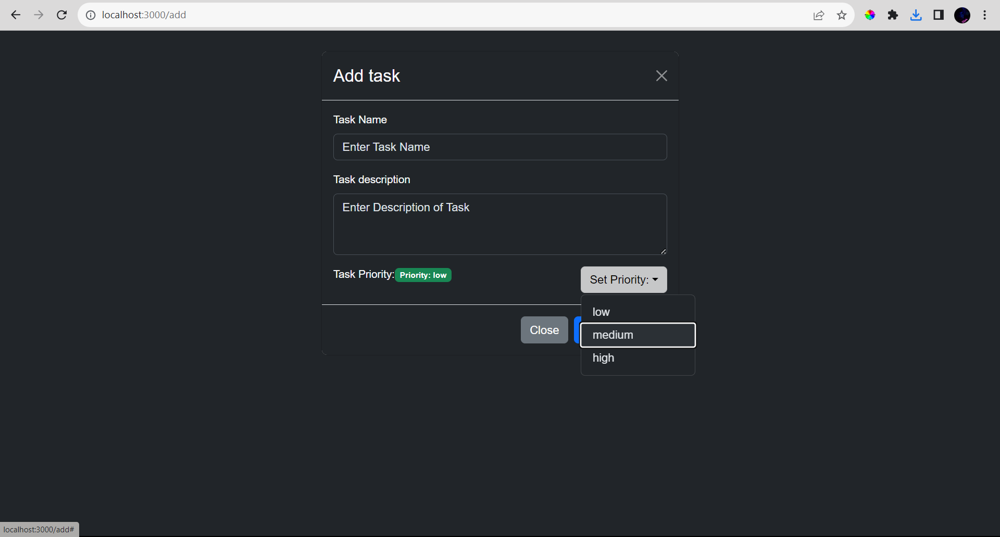

# Task Management App

A simple task management application built with React and Bootstrap.

## Overview

This application provides a user-friendly interface for managing tasks. Users can add, edit, delete tasks, and mark them as completed. The application uses React for the frontend and Bootstrap for styling.

## Features

- Display a list of tasks with task name, description, priority, and completion status.
- Add new tasks with task name, description, and priority level.
- Edit existing tasks, including task name, description, and priority.
- Mark tasks as completed or incomplete.
- Delete tasks.
- Persistent data storage using the browser's local storage.
- Responsive design for a user-friendly interface.
- Sorting tasks based on priority or completion status (optional).
- Pagination for the task list (optional).
- Adding due dates to tasks (optional).

## Project Structure

- **src/**
  - **assets/** - Icon for the application.
  - **components/**
    - **AddButton.jsx** - Component for rendering the "Add Task" button.
    - **AddTask.jsx** - Component for adding new tasks.
    - **EditTask.jsx** - Component for editing existing tasks.
    - **Header.jsx** - Component for the application header.
    - **localStorageUtils.js** - Utility functions for managing local storage.
    - **TaskCard.jsx** - Component for rendering individual task cards.
    - **TaskContext.jsx** - Context for managing state related to tasks.
    - **TaskForm.jsx** - Component for rendering the task form.
    - **TaskList.jsx** - Component for displaying the list of tasks.
    - **TaskListItem.jsx** - Component for rendering individual task items.
    - **TaskModal.jsx** - Component for rendering the modal for adding/editing tasks.

## Setup and Installation

1. **Clone the repository:**
    ```bash
    git clone https://github.com/itsme-shivamkumar/Task-Master.git
    cd task-management-app
    ```

2. **Install dependencies:**
    ```bash
    npm install
    ```

3. **Run the application:**
    ```bash
    npm start
    ```

The application will be accessible at [http://localhost:3000](http://localhost:3000).

## Usage

1. Visit the home page to view the list of tasks.
2. Click on the "Add Task" button to add a new task.
3. Click on the "Edit" button to edit an existing task.
4. Use the checkbox to mark tasks as completed or incomplete.
5. Click on the "Delete" button to remove a task.

## Screenshots


*Caption: Page Desktop Preview.*


*Caption: Adding task preview.*


*Caption: Editing task preview.*

<!-- ## Contributing

Contributions are welcome! Please follow the [contribution guidelines](CONTRIBUTING.md). -->

## License

This project is licensed under the [MIT License](LICENSE).